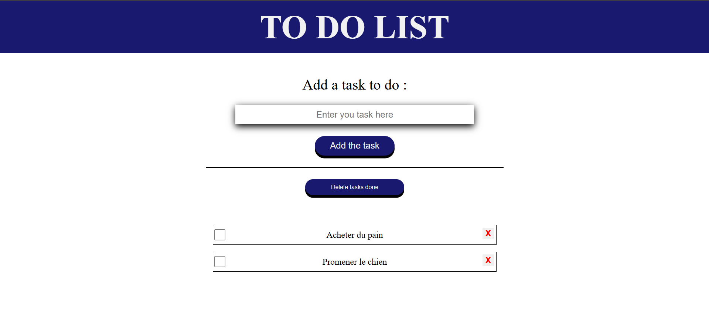

# To-do List

## What's this?

It's a basic to-do list to help you keep track of your tasks.

You can check the left box to mark a task as done.

You can click on the cross on the right to delete a task.

You can click on "Delete all completed tasks" to remove all the tasks marked as done.

Of course, you can write your tasks in the input field and add them to the list.
Everything will still be there the next time you visit the page.

## How does it work?

I built a simple website using HTML and CSS (I'm not a web developer or a designer, so please don't judge me. 😁).

The functionality is implemented in JavaScript, allowing you to add, delete, and check tasks. The list is stored using localStorage, so your tasks remain saved even if you return after a few days.

## What does it look like?

Do you want to test it ??
[Let's go here](https://patoucheh.github.io/to-do-list/)

## Contact me

If you have any advice or spot a bug that needs fixing, feel free to contact me!
I love improving my skills and chatting with other passionate developers.

### Thank you for reading, and happy coding! 🚀
